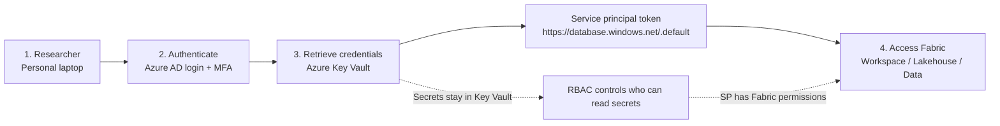

# Fabric Service Principal Access via Azure Key Vault

This access path lets approved researchers use their personal Windows or Mac laptops to reach Microsoft Fabric SQL without storing Fabric service-principal credentials locally.

## Flow



1. Researcher signs in to Azure AD from their laptop.
2. Azure MFA validates the user.
3. The client retrieves the Fabric service-principal tenant ID, client ID, and client secret from Azure Key Vault.
4. The client exchanges those credentials for a Fabric SQL token and connects to the Fabric SQL endpoint.

Secrets are never committed to this repository and are not written to the researcher laptop. Access is controlled by Key Vault RBAC and the service principal's Fabric permissions.

## Azure Resources

| Resource | Value |
|---|---|
| Key Vault | `uzima-secrets-xfmh` |
| Key Vault URL | `https://uzima-secrets-xfmh.vault.azure.net` |
| Key Vault tenant | `4fde8ff3-4dd5-42e1-a25a-e42905610d66` |
| Fabric SP tenant | Stored in `fabric-sp-tenant-id` |
| Fabric SQL server | `fis5jjpzajqe5fxqs4z3vlsjde-zgopmz6jacoezkc3hd6da52lpm.datawarehouse.fabric.microsoft.com` |
| Default database | `uzima_db_backup` |

## Key Vault Secrets

| Secret name | Description |
|---|---|
| `fabric-sp-tenant-id` | Azure AD tenant ID for the Fabric service principal |
| `fabric-sp-client-id` | Application/client ID for the service principal |
| `fabric-sp-client-secret` | Client secret for the service principal |

## Researcher Setup

Install Microsoft ODBC Driver 18 for SQL Server. Python will authenticate to Key Vault interactively when you first connect. By default it opens a browser for Key Vault login.

Install or update the Fabric package directly with pip into your Python user site; no virtual environment is required.

Windows PowerShell:

```powershell
py -3 -m pip install --user "fabricpy[sqlserver] @ git+https://github.com/AKU-CDIO/fabric-inbound-access.git#subdirectory=fabriconnectpy" --upgrade --no-cache-dir
py -3 -c "from fabricpy import connect_to_fabric_sql; print('fabricpy SP SQL import OK')"
```

Mac Terminal:

```bash
python3 -m pip install --user "fabricpy[sqlserver] @ git+https://github.com/AKU-CDIO/fabric-inbound-access.git#subdirectory=fabriconnectpy" --upgrade --no-cache-dir
python3 -c "from fabricpy import connect_to_fabric_sql; print('fabricpy SP SQL import OK')"
```

Then connect. Call `connect_to_fabric_sql()` once, run all reads/queries with that same `conn`, then close it with `conn.close()`. Do not reconnect for each query, because that can trigger repeated authentication:

```python
from fabricpy import connect_to_fabric_sql, list_sql_tables, read_sql_table, query_sql

conn = connect_to_fabric_sql()

print(list_sql_tables(conn))

df = read_sql_table(
    conn,
    "dbo.dimenrolledparticipants",
    columns=["ParticipantIdentifier", "Gender", "Age"],
    top=10,
)
print(df)

summary = query_sql(conn, "SELECT COUNT(*) AS total FROM dbo.dimenrolledparticipants")
print(summary)

conn.close()
```

## R Users

R currently uses Azure CLI to obtain the Key Vault token. Sign in before connecting:

```bash
az login --tenant 4fde8ff3-4dd5-42e1-a25a-e42905610d66
```

```r
install.packages(c("DBI", "odbc", "httr", "jsonlite", "dplyr"))
remotes::install_github("AKU-CDIO/fabric-inbound-access", subdir = "fabriconnect", force = TRUE, upgrade_dependencies = FALSE)

library(fabriconnect)
con <- connect_to_fabric_sql()
list_tables(con)
read_table(con, "dbo.dimenrolledparticipants", columns = c("ParticipantIdentifier", "Gender", "Age"))
query_tables(con, "SELECT COUNT(*) AS total FROM dbo.dimenrolledparticipants")
DBI::dbDisconnect(con)
```

## Admin Checklist

1. Create or reuse the Fabric service principal.
2. Grant the service principal the required read permissions in the Fabric workspace/lakehouse/SQL endpoint.
3. Store the SP tenant ID, client ID, and client secret in Key Vault using the names above.
4. Add approved researchers as B2B guests where needed.
5. Assign approved researchers the `Key Vault Secrets User` role on the Key Vault scope.
6. Keep the service-principal secret rotation process documented and rotate the secret before expiry.

## Configuration Overrides

The repository defaults are stored in `fabricpy/config.json` and `fabriconnect/inst/config.json`. Researchers can override values without editing files:

| Environment variable | Meaning |
|---|---|
| `FABRIC_KEYVAULT_URL` | Key Vault URL |
| `FABRIC_KEYVAULT_TENANT` | Tenant used for Key Vault login |
| `FABRIC_SQL_SERVER` | Fabric SQL endpoint host |
| `FABRIC_SQL_DATABASE` | Fabric SQL database |

## Troubleshooting

| Problem | Fix |
|---|---|
| Sign-in feels slow or repeats | Update the package and use the default browser flow. Do not call `connect_to_fabric_sql()` more than once per script. |
| Key Vault login fails | Confirm the researcher is a guest/user in tenant `4fde8ff3-4dd5-42e1-a25a-e42905610d66`, can complete MFA, and has Key Vault RBAC |
| Key Vault returns forbidden | Confirm the researcher has `Key Vault Secrets User` role on the vault |
| ODBC driver error | Install Microsoft ODBC Driver 18 for SQL Server |
| Fabric SQL login fails | Confirm the service principal has Fabric workspace/lakehouse SQL permissions |
| pip dependency conflict warnings | Update pip, then reinstall with `--upgrade --no-cache-dir` |