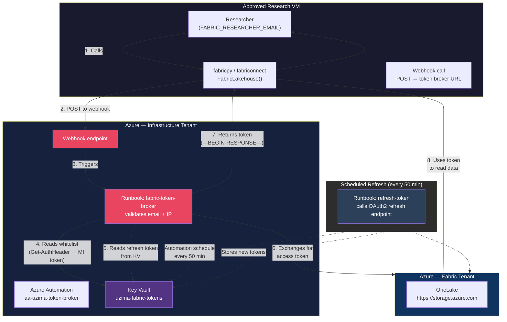
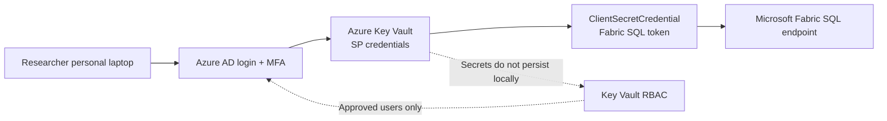

# Token Broker — Process Flow



## Flow Description

### 1. Researcher Requests Data (External)
```python
from fabricpy import FabricLakehouse
lh = FabricLakehouse()          # Reads FABRIC_RESEARCHER_EMAIL
tables = lh.list_tables()       # Triggers auth flow automatically
```

### 2. Webhook Call
The package POSTs to the Azure Automation webhook URL:
```json
{"action": "get_token", "email": "researcher@umich.edu"}
```

### 3. Runbook Validation
The `fabric-token-broker` runbook:
- Extracts caller IP from headers and validates against VM IPs
- Reads the researcher whitelist from Key Vault using Managed Identity
- Checks that the email is approved

### 4. Token Issuance
Runbook reads the stored refresh token from KV, calls the OAuth2 endpoint for a fresh access token, and returns it wrapped in `---BEGIN-RESPONSE---` / `---END-RESPONSE---` markers.

### 5. Data Access
The package caches the token and uses it to read Delta tables from OneLake via the ADLS Gen2 API (abfss://).

### 6. Scheduled Refresh (every 50 min)
A separate `refresh-token` runbook runs on a schedule:
- Reads the refresh token from KV
- Calls `https://login.microsoftonline.com/{tenant}/oauth2/v2.0/token`
- Stores the new access token + refresh token back in KV
This ensures tokens never expire as long as the schedule runs.

## Security Layers

| Layer | What's Checked | Where |
|-------|---------------|-------|
| 1 | VM hostname (`admindsvm`) | R/Python package |
| 2 | Caller IP (`4.245.225.10` / `102.0.6.106`) | Runbook checks webhook headers |
| 3 | Email in whitelist | Runbook reads from Key Vault |
| 4 | Key Vault access | Automation Managed Identity (Get/Set/List) |

## Admin Actions

### Add a researcher to the whitelist
```python
import urllib.request, json

WEBHOOK_URL = "https://a28ba9ca-fccc-4d71-8568-1d6340b357d7.webhook.ne.azure-automation.net/webhooks?token=UIVQO89cW8jEi0CMiTp2XFVC4kArToEMjI8HZBPsSlk%3d"

req = urllib.request.Request(
    WEBHOOK_URL,
    data=json.dumps({"action": "add_email", "admin_email": "admin@aku.edu", "email": "new@umich.edu"}).encode(),
    headers={"Content-Type": "application/json"},
    method="POST"
)
urllib.request.urlopen(req)
```

### List whitelist
```json
{"action": "list_emails", "admin_email": "admin@aku.edu"}
```

### Check token broker status
```json
{"action": "status"}
```

Returns:
```json
{"status": "success", "has_refresh_token": true, "access_token_valid": true, "expires_in_seconds": 3079, "vm_ips": ["4.245.225.10", "102.0.6.106"]}
```


## Service Principal Key Vault Flow



This is the personal-laptop path. It is separate from the VM token-broker path above and should be used when approved researchers need direct Fabric SQL access from Windows or Mac.
